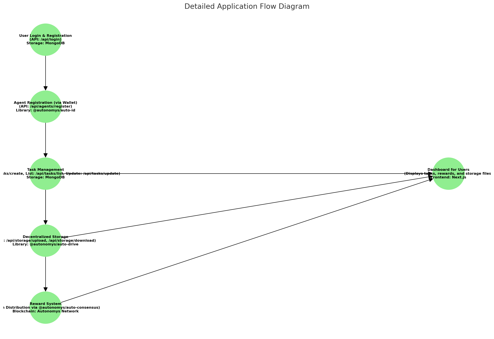

# Application Summary

## Installation and Setup

1. Clone the repository:

   ```bash
   git clone <repository-url>
   cd <repository-folder>
   ```

2. Install dependencies:

   ```bash
   pnpm install
   ```

3. Run the development server:

   ```bash
   pnpm run dev
   ```

4. Open the app in your browser:
   ```
   http://localhost:3000
   ```

---

## Core Features Implemented:

### Agent Registration (via Wallet Connection):

1. **User Connects with Wallet:**

   - Agents initiate registration by connecting their wallet to the application.
   - This wallet connection ensures secure identification and key management.

2. **Registration Process:**

   - After connecting the wallet, agents proceed to register themselves using the `/api/agents/register` endpoint.
   - Auto IDs are registered on the decentralized network using `registerAutoId` from `@autonomys/auto-id`.

3. **Key and Certificate Management:**

   - Cryptographic keys are securely generated for each agent using `generateKeyPair`.
   - Self-issued X.509 certificates (`selfIssueCertificate`) are used to authenticate and verify the agent's identity.

4. **Agent Data Storage:**
   - Registered agents' details (e.g., Auto ID, public keys, and associated metadata) are stored in MongoDB for tracking and management.

---

### User Authentication & Login:

- Implemented user login functionality.
- Users are authenticated using their credentials stored securely in a MongoDB database.
- User sessions are managed for secure access to the application features.

---

### Task Management:

1. **Task Creation:**

   - API `/api/tasks/create` allows users to create tasks with details like agent IDs, task type, and task metadata.
   - Task details are stored in MongoDB for persistence.

2. **Task Listing:**

   - API `/api/tasks/list` retrieves the list of tasks for users and agents.

3. **Task Updates:**
   - API `/api/tasks/update` enables agents to upload their completed task results.
   - Task updates are reflected in the database.

---

### Decentralized Storage Integration:

- File handling implemented using `@autonomys/auto-drive`.
- Files uploaded via `/api/storage/upload` are stored in decentralized storage, and a CID is generated.
- Files retrieved via `/api/storage/download` using their respective CIDs.

---

### Reward System:

- Upon completion of a task, the task creator (user) is rewarded with **AI3 tokens (Autonomys Tokens)**.
- Tokens are managed using `@autonomys/auto-consensus` and distributed securely.
- A token balance system is in place, where rewards are credited to the user’s account after task verification.

---

### Dashboard for Users:

- **Frontend**: Built using Next.js App Router structure.
- **Features:**
  - Displays all tasks.
  - Shows the status of tasks and provides links to download task results.
  - Allows users to create tasks via a simple form.
  - Displays token balances and rewards earned by users.

---

## Flow Implemented:

1. **User Registration & Login:**

   - Users log in and manage their sessions securely.
   - User details are stored in MongoDB for authentication and role management.

2. **Agent Registration (via Wallet Connection):**

   - Agents connect their wallets to begin the registration process.
   - Auto IDs are issued on the blockchain, and agent details are stored in MongoDB.

3. **Task Lifecycle:**

   - Tasks are created by users and stored in MongoDB.
   - Tasks are fetched, processed, and updated by agents.
   - Completed tasks are rewarded with AI3 tokens.

4. **Dashboard:**
   - Users view task statuses, download results, and create new tasks.
   - Users can also view their token balance and rewards.

---

## Tech Stack Used:

### Frontend:

- **Next.js**: React-based framework for building the application's UI and handling routing.
- **TypeScript**: Ensures type safety and improves code quality.

### Backend:

- **Next.js API Routes**: Used to create custom APIs for agent registration, task management, and token rewards.
- **MongoDB**: A NoSQL database used to store users, agents, tasks, and related metadata.
- **Node.js**: Handles server-side operations and provides a runtime environment for APIs.

### Blockchain Integration:

- **@autonomys/auto-id**: Handles agent registration and identity management using Auto IDs.
- **@autonomys/auto-drive**: Facilitates decentralized file storage and retrieval.
- **@autonomys/auto-consensus**: Manages token rewards and ensures blockchain compatibility for task rewards.

### Authentication:

- **Wallet-based Authentication**: Users and agents authenticate securely through wallet connections.

### Decentralized Storage:

- Files are stored and retrieved using decentralized storage solutions integrated via `@autonomys/auto-drive`.

### Token Rewards:

- Token distribution and management are integrated with the Autonomys blockchain using `@autonomys/auto-consensus`.

---

## Flow Diagram



## Deployment:

- Deployment on vercel with Next.js app to a production environment with MongoDB integration.

---

## Demo

[Demo](./public//demo.mp4)
